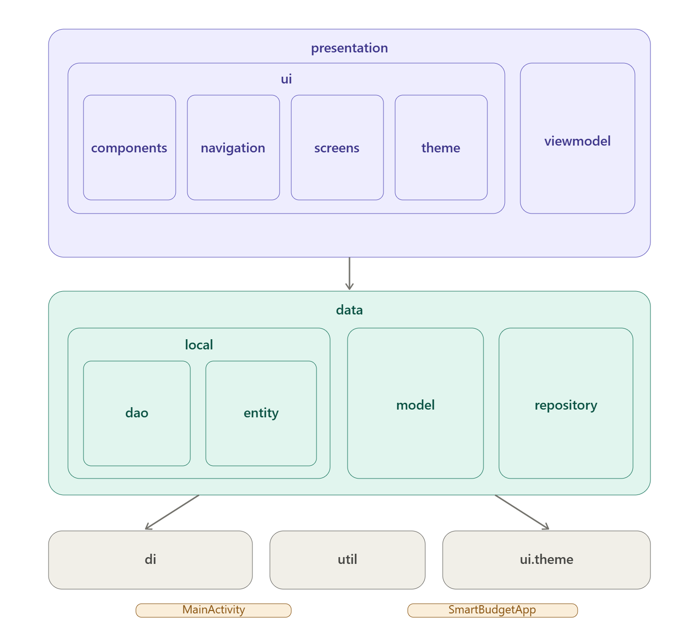

# SmartBudget - Android

Application Android de gestion de budget personnel, conçue pour aider les étudiants à suivre leurs dépenses quotidiennes et visualiser où part leur argent.

## Fonctionnalités

Les fonctionnalités couvertes par ce projet sont les suivantes :
- CRUD : Gestion complète des dépenses (CRUD : Créer, Lire, Modifier, Supprimer)
- Catégorisation : Catégorisation des dépenses avec 7 catégories prédéfinies
- Navigation : Navigation temporelle par mois (mois précédent / suivant)
- Statistiques : Statistiques et répartition par catégorie
- Autres (Bonus)
-	Dépenses récurrentes (exemple : loyer, abonnements)
-	Affichage en détails de chaque dépense 
-	Export CSV des données du mois
-	Ajout d'un système de notifications pour les dépassements de budget (>4000 MAD)
-	Thème sombre (dark mode)
-	Petite animation pour la dépense la plus chère

## Stack technique

- **Langage** : Kotlin
- **UI** : Jetpack Compose + Material Design 3
- **Base de données** : Room (SQLite)
- **Architecture** : MVVM + Repository Pattern
- **Navigation** : Jetpack Navigation Compose
- **Icônes** : Material Icons Extended

## Architecture du projet

## Écrans

| Écran | Description |
|---|---|
| Dépenses | Liste des dépenses du mois courant avec filtres par catégorie, navigation mois précédent/suivant et bouton d'ajout |
| Statistiques | Répartition des dépenses par catégorie et top postes |
| Formulaire | Écran modal d'ajout et de modification d'une dépense (montant, catégorie, date, note) |
| Paramètres | Gestion des catégories et préférences |
| Détail d'une dépense | Affichage en détail de chaque dépense  |
| Formulaire | Ajout d’une nouvelle catégorie |

## Lancer le projet

1. Cloner le repo
2. Ouvrir dans Android Studio
3. Synchroniser Gradle
4. Lancer sur un émulateur ou appareil Android (API 36.0 idéal)

## Auteur

Lorraine301
